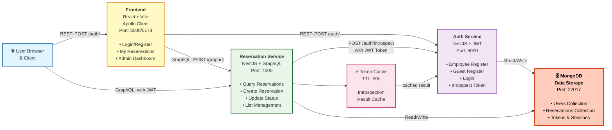

# Hilton Reservation

本项目提供一个示例性的「预订（Reservation）」全栈结构：后端采用 NestJS + GraphQL + MongoDB，前端采用 React + Vite + Apollo Client，并包含一个用于 JWT 校验/用户角色管理的独立认证服务（auth-service）。当前版本在单元测试、Schema 示例、按钮/状态管理以及更清晰的角色分离方面做了增强。

> 说明：以下文档为原英文 README 的中文翻译与结构化 Markdown 版本；环境变量与字段名等技术标识保留英文。

---

## 🏗️ 系统架构（System Architecture）



### 架构说明

- **Frontend**：React + Vite 前端应用，通过 Apollo Client 与后端通信
- **Auth Service**：独立的认证服务，负责用户注册、登录、Token 校验
- **Reservation Service**：核心业务服务，提供 GraphQL API，通过 introspection 调用 Auth Service 验证 Token
- **🗄️ MongoDB**：共享数据库存储，采用特殊图标标识，存储用户、预约、Token 等数据
- **Token Cache**：减少频繁调用 Auth Service 的 introspection 端点，提升性能

### 关键交互流程

#### 1. **认证流程**

- Guest 登录：发送 email/phone → Auth-Service 验证 → 签发 JWT
- Employee 登录：发送 username/password → Auth-Service 验证密码 → 签发 JWT

#### 2. **预订操作流程**

- 前端发送 GraphQL Query/Mutation（包含 JWT 在 Authorization header）
- Reservation-Service 接收请求
- 调用 Auth-Service 的 introspection 端点验证 Token（带 TTL 缓存）
- 根据 Token 中的角色（role）与用户 ID（sub）执行对应操作
- MongoDB 中查询/修改数据，返回结果给前端

#### 3. **权限分离**

| 操作         | Guest | Employee |
| ------------ | ----- | -------- |
| 查看个人预约 | ✅    | ✅       |
| 创建预约     | ✅    | ✅       |
| 管理全部预约 | ❌    | ✅       |
| 修改预约状态 | ❌    | ✅       |

---

## 🔧 核心说明

1. `docker-compose.yml` 中使用了一个本地 docker MongoDB 容器。
2. 若要接入真实的 MongoDB，请在 `reservation-service/.env`（或 backend/.env）里设置：`COSMOS_MONGO_URI=<Cosmos 连接串>`，并移除/忽略本地 mongo 服务。
3. 后端 GraphQL 输入类型使用 `@nestjs/graphql` + `class-validator` 做了严格校验。
4. 单元测试示例展示了如何用 `jest-mock-extended` 来 mock Mongoose Model；本地运行时可根据需要进一步补充。

---

## 🔐 认证与环境（Reservation Service）

在 `reservation-service/.env` 中需要设置（示例）：

```env
COSMOS_MONGO_URI=mongodb://localhost:27017/hilton_reservations
JWT_SECRET=change_me_dev
CORS_ORIGINS=http://localhost:5173
```

- `JWT_SECRET`：用于本地直接验证 Token（开发默认值 `dev-secret` 仅供本地使用，勿用于生产）。
- 也可以切换为「Introspection 模式」由 `auth-service` 统一校验（见下节）。

---

## 🔍 Introspection 模式（与 Auth-Service 集成）

与其在 reservation-service 内部直接 `jwt.verify`，可改为调用 `auth-service` 的 `POST /auth/introspect`：

在 `reservation-service/.env` 增加：

```env
AUTH_INTROSPECTION_URL=http://localhost:3001/auth/introspect
INTROSPECTION_CACHE_TTL_MS=30000
```

调用流程：

1. 从请求头中抽取 `Authorization: Bearer <token>`。
2. 发送 `POST { token }` 至 introspection URL。
3. 返回 `active=true` 时，将 `{ sub, role, username? }` 附着到请求上下文作为当前用户。
4. 后续 GraphQL Guard 只检查角色；无需本地解析签名。

接口契约（auth-service）：

```http
POST /auth/introspect
Body: { token: string }
Response: {
  active: boolean,
  sub?: string,
  role?: 'guest' | 'employee',
  username?: string,
  exp?: number,
  iat?: number
}
```

---

## 🔑 GraphQL 授权使用（Reservation Service）

客户端需在请求头添加：

```
Authorization: Bearer <jwt>
```

Token 载荷（payload）需包含：

```json
{ "sub": "<userId>", "role": "guest" | "employee" }
```

主要操作与角色限制：

| 操作                    | 说明                                   | 角色               |
| ----------------------- | -------------------------------------- | ------------------ |
| `myReservations`        | 当前用户（或员工查看全部？视实现而定） | guest / employee   |
| `reservations` (带过滤) | 预约列表管理                           | employee           |
| `createReservation`     | 创建预约（自动关联 token 中 userId）   | guest / employee   |
| `updateReservation`     | 更新预约                               | employee（或受限） |
| `setReservationStatus`  | 修改预约状态                           | employee           |
| `cancelMyReservation`   | 取消本人预约                           | guest              |

> 具体以当前 resolver 实现为准；若有变动，请同步更新此表。

---

## 🌐 前端环境变量（Frontend）

在 `frontend/.env`（或运行前导出）设置：

```env
VITE_GRAPHQL_ENDPOINT=http://localhost:3002/graphql
VITE_AUTH_BASE_URL=http://localhost:3001
```

---

## 🧭 前端角色与导航体验（v2 UX）

| 用户类型 | 登录方式                | 能力/入口                                        |
| -------- | ----------------------- | ------------------------------------------------ |
| Guest    | email 或 phone 至少一个 | 查看 & 管理个人预约（My Reservations）、创建预约 |
| Employee | username + password     | 管理全部预约、更新状态                           |

菜单动态：

- Guest：`My Reservations`，新建等操作。
- Employee：`Admin Reservations`（预约管理页）。

---

## 🔗 Auth API（`frontend/src/api/auth.ts`）

Employee：

```http
POST /auth/register/employee { username, password }
→ { id, username, role: 'employee' }

POST /auth/login/employee { username, password }
→ { access_token }
```

Guest：

```http
POST /auth/register/guest { username, email?, phone? }
# username 必填；email / phone 至少一个
→ { id, role: 'guest', username, email?, phone? }

POST /auth/login/guest { email?, phone? }
# 至少一个
→ { access_token }
```

通用 introspection：

```http
POST /auth/introspect { token }
→ { active, sub, role, exp }
```

---

## 🧪 本地开发快速启动 (Local Dev Quick Start)

1. 启动 auth-service（默认端口 3001）。
2. 启动 reservation-service（确保端口 3002 或与前端配置匹配）。
3. 前端设置环境变量后运行：`npm run dev`（Vite 默认端口 5173）。
4. 使用 Employee 账户登录（需先通过 `/auth/register/employee` 或直接 DB 插入）。
5. 使用 Guest 账户登录，创建并查看个人预约。

---

## ❓ 常见问题 (FAQ)

**Q: 为什么要用 introspection 而不是直接在服务里验证 JWT？**  
A: 统一由 auth-service 处理可集中管理密钥轮换、黑名单、扩展字段（如邮箱、电话）并可加缓存层。

**Q: 可以直接切换到 Azure Cosmos DB 吗？**  
A: 可以，只需提供对应的 Mongo API 连接串到 `COSMOS_MONGO_URI`，并移除本地 Mongo 容器。

**Q: 单元测试中的 Mongoose mock 无法满足更复杂聚合？**  
A: 可针对复杂查询引入 in-memory-mongodb（如 `mongodb-memory-server`）或扩展自定义 mock。

---

## 🚢 部署与运行说明（Deployment & Run）

### 1. 使用 docker-compose（推荐集成演示）

项目根目录已有 `docker-compose.yml`,运行如下命令启动所有服务：

```bash
docker compose up -d --build
```

若需覆盖环境变量，可在根目录创建 `.env` 或直接在 compose 服务节里添加 `environment` 字段。

常见可配置变量（部分）：

| 变量                         | 作用                           | 默认/示例                                 |
| ---------------------------- | ------------------------------ | ----------------------------------------- |
| `COSMOS_MONGO_URI`           | Reservation Service Mongo 连接 | mongodb://mongo:27017/hilton_reservations |
| `JWT_SECRET`                 | 本地 JWT 验证密钥              | change_me_dev                             |
| `AUTH_INTROSPECTION_URL`     | introspection 接口             | http://auth:3001/auth/introspect          |
| `INTROSPECTION_CACHE_TTL_MS` | introspection 缓存毫秒         | 30000                                     |
| `VITE_GRAPHQL_ENDPOINT`      | 前端 GraphQL 目标              | http://localhost:3002/graphql             |
| `VITE_AUTH_BASE_URL`         | 前端 Auth API 基址             | http://localhost:3001                     |

### 3. 生产环境部署建议

- 使用 **反向代理 / API Gateway**（Nginx / Traefik）统一路由，并启用 HTTPS。
- 将 `auth-service` 与 `reservation-service` 拆分为独立容器或 K8s Deployment；MongoDB 使用托管云（Atlas / Cosmos DB）。
- 通过环境变量注入密钥与连接串，避免将敏感信息写入镜像。
- 打开严格的 CORS 白名单（仅可信域名）。
- GraphQL 可开启：
  - 深度限制（已引入 `graphql-depth-limit`）。
  - 查询复杂度限制（可再引入自定义规则）。
  - 禁用 Playground（生产）或改用 Apollo Sandbox 受限访问。
- 日志与监控：采集 Docker / Pod 日志至 ELK / Loki；增加健康检查端点（Nest 内置 `/health` 可扩展）。
- 安全：
  - 定期轮换 `JWT_SECRET` 或迁移到 JWK / 公私钥签名。
  - 对 Auth 接口添加速率限制（Nginx limit_req 或 Nest 中间件）。
  - 使用 Helmet 等安全 header（在 Express 层）。

### 4. 灰度 & 回滚策略（概述）

- 采用版本化镜像标签（如 `reservation-service:v1.2.0`）。
- 通过 CI/CD（GitHub Actions）在合并主分支后自动构建并推送镜像。
- 使用 K8s RollingUpdate，若探针失败即回滚；或利用 Argo Rollouts 做金丝雀发布。

### 5. 常见部署踩坑提示

| 场景               | 症状                | 排查要点                                      |
| ------------------ | ------------------- | --------------------------------------------- |
| 前端 404           | 刷新路由子路径      | 确保前端容器静态资源 fallback 到 `index.html` |
| GraphQL CORS 报错  | 浏览器 Console CORS | 检查 `CORS_ORIGINS` 与代理层 header 透传      |
| Introspection 失败 | 401 或 active=false | 确认 auth-service URL / Token 是否过期        |
| Mongo 连接拒绝     | ECONNREFUSED        | 网络 / DNS 或连接串拼写；容器互联别名         |
| JWT 过期太快       | 频繁登录            | 在 auth-service 调整签发过期时间（exp）       |

---

## 🧱 技术栈组成与选型理由（Tech Stack & Rationale）

| 组件       | 选型                                          | 理由摘要                                                                       |
| ---------- | --------------------------------------------- | ------------------------------------------------------------------------------ |
| 后端框架   | NestJS                                        | 模块化、依赖注入、装饰器语义清晰，适合中大型服务扩展；与 TypeScript 自然结合。 |
| API 协议   | GraphQL (Apollo Server 5)                     | 前端自选字段、减少过/欠取；复杂查询可控；与前端 Apollo 客户端生态完善。        |
| 数据库     | MongoDB (Mongoose ODM)                        | 文档型适合柔性迭代 Reservation 结构；内嵌/索引灵活；Mongoose schema + 校验。   |
| 认证       | JWT + Introspection                           | JWT 无状态扩展性 + 通过 introspection 支持集中权限/字段增强与缓存。            |
| 前端框架   | React 18 + Vite                               | 快速开发与 HMR 体验；Vite 构建速度优于传统 webpack；React 生态成熟。           |
| 状态与数据 | Apollo Client                                 | GraphQL Query/Mutation/Cache 集成；后续易加 optimistic UI、分片缓存策略。      |
| UI 组件    | Ant Design 5                                  | 丰富高质量企业级组件、设计语言统一、Form/Modal/Table 组合效率高。              |
| 时间处理   | dayjs                                         | 轻量替代 moment，API 直观；格式化与时区处理足够当前场景。                      |
| 测试       | Jest (后端) / Vitest + Testing Library (前端) | 一致的断言风格；Vitest 与 Vite 深度集成，前端测试启动快。                      |
| 校验       | class-validator / class-transformer           | 与 Nest 装饰器一体化；请求 DTO 直接声明式约束。                                |
| 安全       | passport + passport-jwt/basic                 | 利用成熟中间件生态，减少手写安全逻辑。                                         |

### 设计权衡

- GraphQL vs REST：本示例含多角色（guest/employee），GraphQL 可让前端在同一 Schema 下灵活获取字段；若仅少量固定端点 + 高吞吐，REST 也可行。
- MongoDB vs SQL：预订对象结构演进快（如添加联系方式扩展）且关系简单（单用户关联），文档库降低迁移成本；若未来要跨表统计或事务一致性，可考虑 PostgreSQL。
- 单体服务拆分：当前仅 `auth-service` 与 `reservation-service` 分离——认证解耦有利于后续复用（如其它业务域）；其余逻辑仍集中，便于加速迭代。
- Introspection 缓存：用 TTL 缓存减少频繁调用 auth-service；防止过度调用造成级联延迟。
- Ant Design：牺牲一定 bundle 体积换取快速成型；如需极致性能可按需（babel-plugin-import）与 CSS 分拆。

### 未来可替换/升级点

- GraphQL Schema 可加 Federation 准备（若多域拆分）。
- Apollo Client 可引入 `@apollo/experimental-nextjs-app-support`（若迁移到 Next.js）。
- 认证可迁移至 OpenID Connect / Keycloak / Auth0 以统一账号体系。
- 增加事件总线（Kafka / NATS）实现异步通知（如状态变更推送）。

---

## 🗂 项目结构说明（Project Structure）

顶层目录（monorepo 风格）同时容纳前端与两个后端服务，方便本地一次性启动与联调：

```
├── auth-service/                # 认证与用户管理（JWT 签发 / introspection）
│   ├── src/auth/                # 模块主体（controller / service / dto / guards / strategies / schemas）
│   ├── jest.config.js           # 后端单元测试配置
│   └── package.json
├── reservation-service/         # 预订核心服务（GraphQL）
│   ├── src/reservations/        # Reservation 领域：resolver / service / dto / schema
│   ├── src/common/auth/         # Introspection 客户端、Guard、角色装饰器
│   ├── src/common/*             # 公共异常过滤/日志
│   ├── schema.gql               # 生成的 GraphQL Schema Snapshot（便于前端参考）
│   └── test/                    # Jest 测试：服务、上下文、客户端
├── frontend/                    # React + Vite 前端
│   ├── src/apollo/              # Apollo Client 实例配置
│   ├── src/auth/                # 前端 Auth 上下文、受保护路由
│   ├── src/components/          # 复用组件（ActionButton, ReservationDetail 等）
│   ├── src/pages/               # 页面级容器（AdminReservations, MyReservations, Login 等）
│   ├── src/graphql/             # 查询与 Mutation 定义
│   ├── src/types/               # TypeScript 类型（状态颜色、Reservation/用户等）
│   ├── src/utils/               # 工具（时间格式化）
│   └── src/__tests__/           # 前端 Vitest 测试（菜单渲染、状态颜色）
├── docker-compose.yml           # 一键本地编排（mongo + services + frontend 可拓展）
├── README.md                    # 项目文档
└── (Dockerfile.*)               # 各服务容器化定义
```

### 结构设计动机

1. **明确边界**：认证与业务（预订）隔离，便于未来独立扩展如多应用复用同一 Auth。
2. **渐进式拆分**：当前仅两个服务，减少复杂度；未来可再拆订单、通知等子域。
3. **前端内聚**：所有 GraphQL 操作、组件与页面在一个目录内，便于重构与 Tree-Shaking。
4. **测试靠近代码**：后端测试与领域目录平行；前端测试放在 `__tests__` 单独集中，避免与页面目录混淆。
5. **Schema 快照**：`schema.gql` 让非 TypeScript 读者也能快速了解 API 形状。
6. **可演进性**：保留空间添加 `scripts/`（数据迁移、批处理）或 `infrastructure/`（IaC）。

## ✅ 测试报告（Test Report）

### 运行环境

- Node.js 18+（本地开发机 macOS）
- Jest 用于后端单元测试；Vitest 用于前端组件/行为测试。

### Auth-Service 测试

| 指标              | 数值   |
| ----------------- | ------ |
| 测试套件 (suites) | 2 通过 |
| 用例 (tests)      | 5 通过 |
| 快照              | 0      |
| 时长              | ~3.4s  |

覆盖重点：

- `auth.service`：注册/登录逻辑、加密/验证流程。
- `introspection.service`：Token introspection 返回结构与 active 判定。

### Reservation-Service 测试

| 指标     | 数值    |
| -------- | ------- |
| 测试套件 | 3 通过  |
| 用例     | 10 通过 |
| 快照     | 0       |
| 时长     | ~1.4s   |

覆盖重点：

- `reservations.service`：创建、更新、状态变更、用户关联。
- `introspection.client`：缓存 + 远程调用逻辑。
- 上下文授权（context.auth）基础校验。

### Frontend (Vitest)

| 指标     | 数值   |
| -------- | ------ |
| 测试文件 | 2 通过 |
| 用例     | 5 通过 |
| 时长     | ~3.0s  |

覆盖重点：

- 菜单基于角色渲染（匿名 / guest / employee）。
- 状态颜色映射完整性（无重复颜色）。

警告：React Router v7 未来 flag/`act` 包裹提示（UI 行为不受影响）。可在后续测试中使用 `userEvent`/`act` 包装或启用未来标志解决。

---
